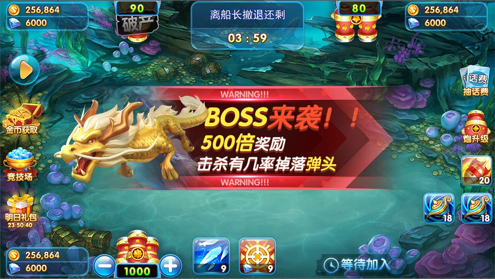
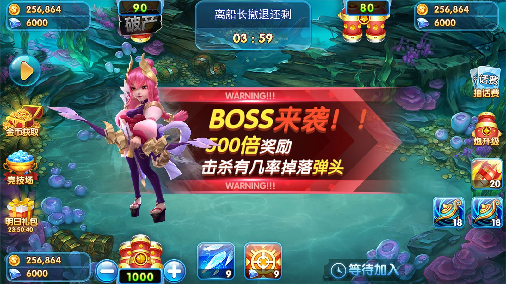

# 捕魚遊戲美術資源｜Boss、魚類圖集與動畫素材

[简体中文](README.zh-CN.md) · [繁體中文](README.zh-TW.md) · [English](README.en.md) · [产品页面](https://niubideren111.github.io/Fishing-Game-Art-Assets/zh-tw/)

展示捕魚遊戲 Boss、魚類圖集及動畫配套文件。儲存庫中的 PNG、atlas 和 JSON 文件可用於了解素材組織結构，場景截圖展示素材在捕魚遊戲中的組合效果。

**捕魚遊戲美術資源 · 捕魚素材 · 捕魚Boss素材 · 捕魚遊戲圖集**


## ✨ Asset Includes | 资源内容 | 資源內容

* 🐟 Fish sprites（鱼类素材）
* 🎮 Game UI（界面UI）
* 💥 Effects（特效）
* 🎯 Icons & elements（图标与元素）
* 🌊 Backgrounds（背景）
* 3D模型

---

## 💡 Use Cases | 使用场景 | 使用場景

* Fishing game development（捕鱼游戏开发）
* Arcade game（街机游戏）
* Mobile game（手游）
* Unity / Cocos projects


## 專案重點

### Boss 效果預覽

展示不同 Boss 與战斗場景的視覺組合，便於美術风格评估。

### 圖集與動畫配套

01 至 07 等目錄保留 PNG、atlas 和 JSON 組合，可逐組檢查資源依赖。

### 設計資料資料

附有道具列表與掉落判定表，供美術資源與玩法字段對照。

## 資料閱讀與核對方式

1. **先確認產品形態**：依序檢視截圖與圖說，確認產品類型和可見功能流程。
2. **再核對檔案證據**：直接開啟下方列出的原始碼或文件，不只依賴功能描述。
3. **檢查可建置範圍**：確認欲執行的部分是否具備相依套件、資源、設定與啟動腳本。
4. **確認授權**：閱讀儲存庫授權；商業素材及完整工程交付應另行取得書面授權。

## 產品截圖





## 公開原始碼與資料

| 文件 | 说明 |
|---|---|
| [boss2.jpg](boss2.jpg) | Boss 战斗效果圖 |
| [01/by_01.png](01/by_01.png) | 魚類纹理圖集 |
| [01/by_01.atlas](01/by_01.atlas) | 圖集描述 |
| [01/by_01.json](01/by_01.json) | 動畫資料 |
| [道具列表及道具掉落服务器判定.xlsx](%E9%81%93%E5%85%B7%E5%88%97%E8%A1%A8%E5%8F%8A%E9%81%93%E5%85%B7%E6%8E%89%E8%90%BD%E6%9C%8D%E5%8A%A1%E5%99%A8%E5%88%A4%E5%AE%9A.xlsx) | 道具設計表 |

## 開始閱讀

```bash
git clone https://github.com/niubideren111/Fishing-Game-Art-Assets.git
cd Fishing-Game-Art-Assets
```

## 常見問題

### 美術資源和捕魚原始碼是同一專案吗？

不是。本專案提供美術素材展示與样例；用戶端和伺服器端程式碼片段見捕魚原始碼專案。

### 導入素材時應保留哪些文件？

同一組 PNG、atlas 和 JSON 應一起保留，並核對專案動畫執行庫的版本。

## 後續資料完善方向

按 fish、boss、ui、effects 分類逐批上傳样例；附尺寸、格式、動畫執行庫版本與授權說明。 後續更新還應加入版本化相依清單、經過驗證的建置或匯入步驟、簡明架構／產品流程圖，以及能對應真實檔案變更的版本記錄。大型授權資源可放入 GitHub Releases 並提供校驗值，不能提交密鑰、生產位址或使用者資料。

## 相關專案

- [Fishing-Game-Source-Code](https://github.com/niubideren111/Fishing-Game-Source-Code)
- [Chess-and-Card-Game-Product-Design-Copy](https://github.com/niubideren111/Chess-and-Card-Game-Product-Design-Copy)

## 資料範圍與授權

公開儲存庫提供部分圖集和動畫文件以及效果預覽；完整美術素材包與授權範圍透過專案聯絡方式溝通。 公開內容以實際檔案、相依套件與授權為準，不承諾搜尋排名、直接上線或固定效能結果。

- Telegram: [@fox_lovemyself](https://t.me/fox_lovemyself)
- GitHub: [Fishing-Game-Art-Assets](https://github.com/niubideren111/Fishing-Game-Art-Assets)
